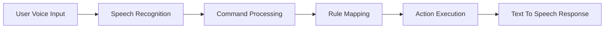
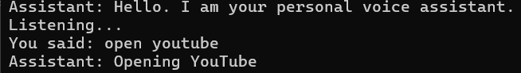
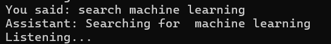

# 🎤 Personal Voice Assistant (Python)


A **Python-based Personal Voice Assistant** that listens to user voice commands, converts speech into text, processes commands using rule-based logic, and performs tasks such as opening applications, searching the web, and telling the current time.

This project demonstrates **speech recognition, automation, and system command execution** using Python.

---

# 🚀 Features

✔ Speech-to-text using **SpeechRecognition**
✔ Text-to-speech responses using **pyttsx3**
✔ Rule-based command processing
✔ Open websites and applications
✔ Search the web using voice commands
✔ Tell the current system time
✔ Built-in **help command**
✔ Robust error handling

---

# 🧠 System Architecture



The assistant follows a simple pipeline:

1️⃣ Capture voice input
2️⃣ Convert speech to text
3️⃣ Identify command
4️⃣ Execute action
5️⃣ Speak response

---

# 📂 Project Structure

```
voice_assistant/
│
├── main.py
├── speech_engine.py
├── command_handler.py
├── actions.py
│
├── sample_commands.txt
├── requirements.txt
└── README.md
```

This modular structure allows **easy scalability and maintenance**.

---

# ⚙️ Installation

Clone the repository

```
git clone https://github.com/yourusername/voice-assistant.git
```

Navigate to project folder

```
cd voice-assistant
```

Create virtual environment

```
python -m venv venv
```

Activate environment

Windows

```
venv\Scripts\activate
```

Install dependencies

```
pip install -r requirements.txt
```

---

# ▶️ Run the Assistant

```
python main.py
```

---

# 🎤 Example Commands

```
open youtube
open google
search artificial intelligence tutorials
what is the time
open notepad
open calculator
help
exit
```

---

# 🖼️ Screenshots

### Assistant Running



### Command Recognition




---

# ⚠️ Error Handling

The assistant handles common issues such as:

• Unrecognized speech input
• Network errors during speech recognition
• Invalid or unsupported commands

Example response:

```
Assistant: Sorry, I did not understand.
Assistant: Command not recognized.
```

---

# 📦 Dependencies

```
SpeechRecognition
pyttsx3
pyaudio
```

---

# 🔗 References

SpeechRecognition Documentation
https://pypi.org/project/SpeechRecognition/

pyttsx3 Documentation
https://pypi.org/project/pyttsx3/

---

# 👨‍💻 Author

**Ahmed Faheen**

AI / Machine Learning Enthusiast
Passionate about building AI-powered applications and automation tools.

---

# ⭐ Support

If you like this project, please **give it a star ⭐ on GitHub**.

It helps others discover the project and supports future improvements.
